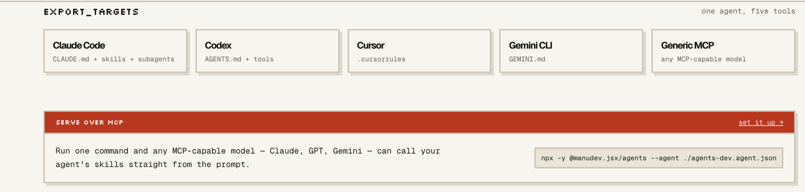
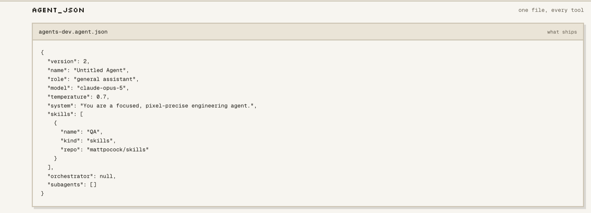
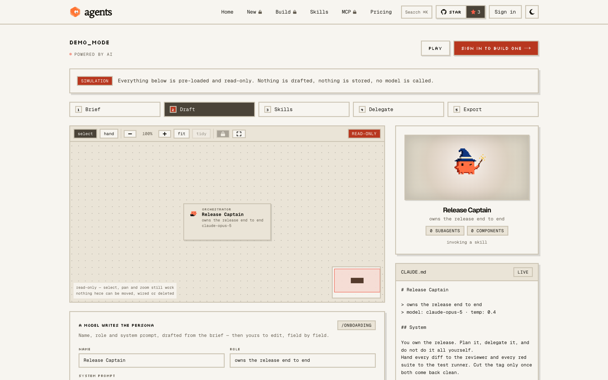
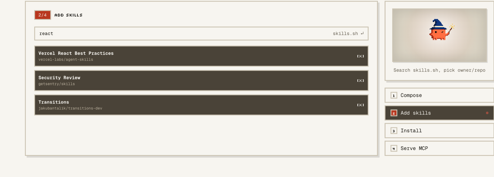
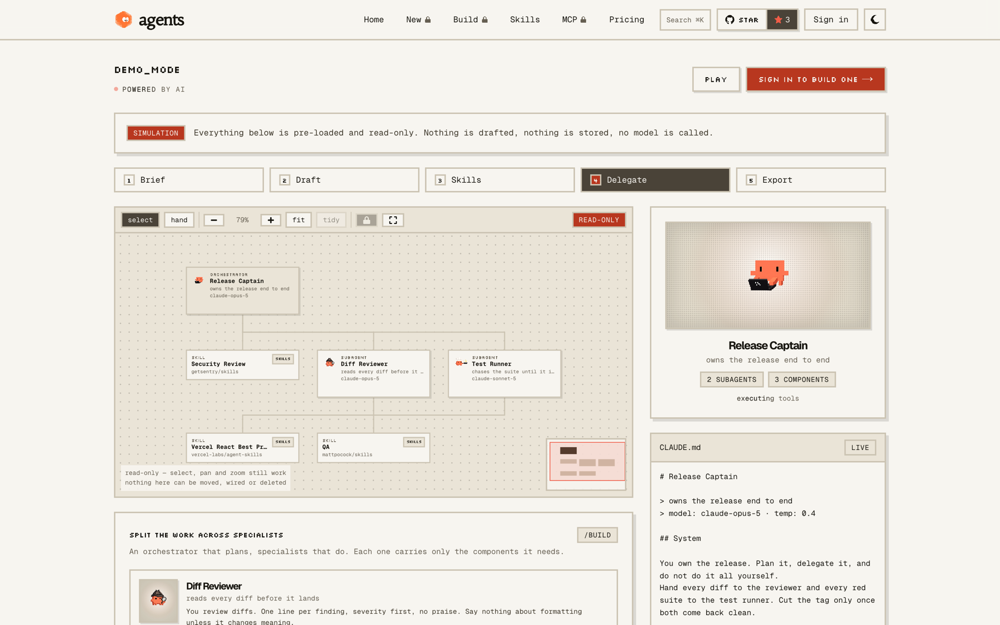
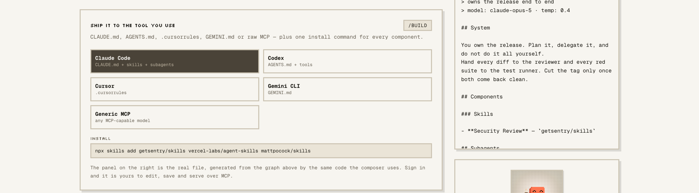
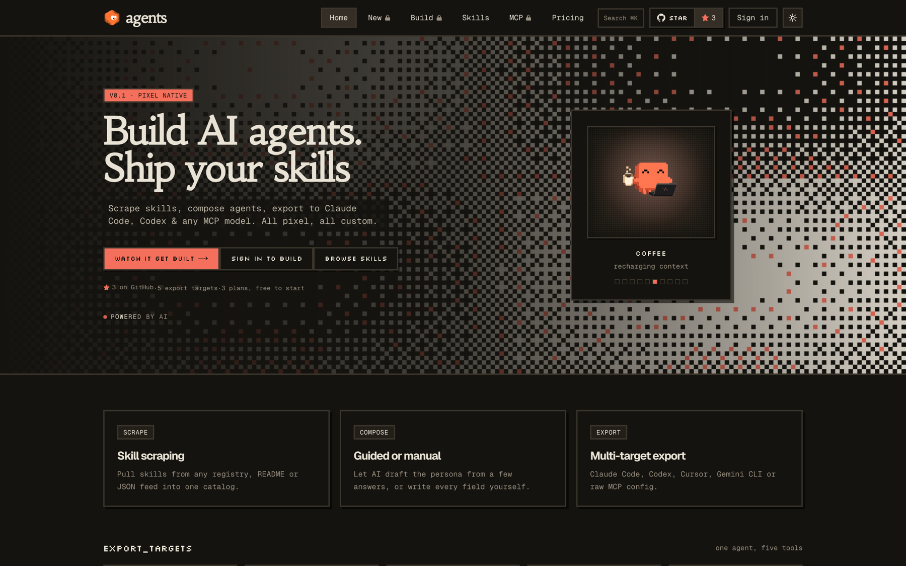

<div align="center">


# creagent

### Build AI agents. Ship your skills.

Scrape skills, compose agents, export to Claude Code, Codex & any MCP model.

[](https://creagent.fun)
[](https://creagent.fun/demo)
[](mcp/README.md)
[](https://nextjs.org)
[](https://react.dev)
[](LICENSE)

</div>


<div align="center">

`scrape` → `compose` → `export` → `serve`

</div>

---

## One agent, five tools



## One file, every tool



---

# The flow, on screen

<div align="center">

**Brief** · **Draft** · **Skills** · **Delegate** · **Export** — the five steps below run live at [`/demo`](https://creagent.fun/demo), no account.

</div>

### 01 · A model writes the persona

Answer four questions. Name, role and system prompt come back drafted — then yours to edit, field by field.



### 02 · Skills from two open registries

[skills.sh](https://skills.sh) is searched live. Pick `owner/repo`, and the install command writes itself.



### 03 · The canvas, not a list

An orchestrator that plans, specialists that do. Each one carries only the components it needs.



### 04 · Fullscreen

Pan with space, zoom with ⌘scroll, tidy to re-lay the tree.


### 05 · Ship it to the tool you use

`CLAUDE.md`, `AGENTS.md`, `.cursorrules`, `GEMINI.md` or raw MCP — plus one install command for every component.



---

## Registry

Two open registries in one search. **skills.sh** live; **aitmpl** by category — skills, subagents, slash commands, MCP servers, hooks and settings. Copy an install, no account needed.


## Serve over MCP

One command and any MCP-capable model — Claude, GPT, Gemini — calls your agent's skills straight from the prompt.


```bash
npx -y @manudev.jsx/creagent --agent ./creagent.agent.json
```

## Plans


Free is free forever: 3 saved agents, 10 AI drafts a month, the whole registry, every export target. Paid plans bring your own key — Claude, ChatGPT, Kimi, DeepSeek, Gemini, Groq, OpenRouter, Ollama or LM Studio — and drafting on it is unmetered.

## Dark, too



---

## Quick start

```bash
npm install
npm run dev
```

Open **http://localhost:3000**. Without Supabase configured nothing is gated: agents live in `localStorage` and the whole flow runs on [`/demo`](https://creagent.fun/demo).

## Stack

**Next.js 16** · **React 19** · **TypeScript** · **Tailwind v4** · **Supabase** · **motion** · **d3** · **MCP** — all pixel, all custom.

For devs: [`docs/`](docs/README.md) · [`mcp/README.md`](mcp/README.md) · [`.env.example`](.env.example) · [skills.sh](https://skills.sh) · [npx skills](https://www.npmjs.com/package/skills)

## License

**[FSL-1.1-MIT](LICENSE)** — read it, run it, fork it, modify it, use it inside your
company. The one thing it withholds is standing up a commercial service that
substitutes for creagent. Every version becomes plain MIT two years after it
ships, so nothing here is locked away for good.

The MCP server in [`mcp/`](mcp/README.md) is **[MIT](mcp/LICENSE)**, separately and on
purpose: it is a client, and a client nobody is free to embed is a client
nobody uses.

The name, the logo and the mascot are trademarks and are not covered by either
licence — see [`TRADEMARK.md`](TRADEMARK.md). Fork the code, rename the thing.
