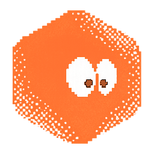
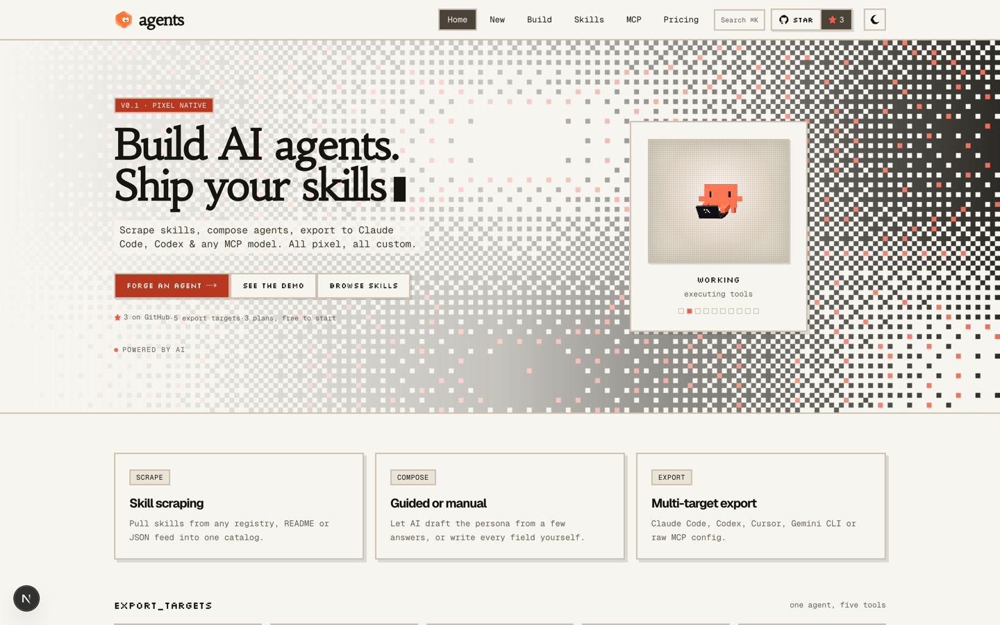
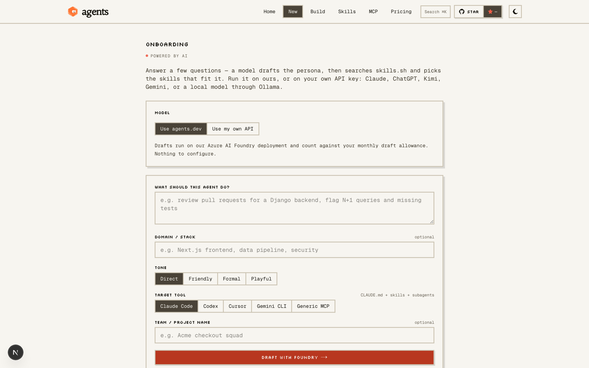
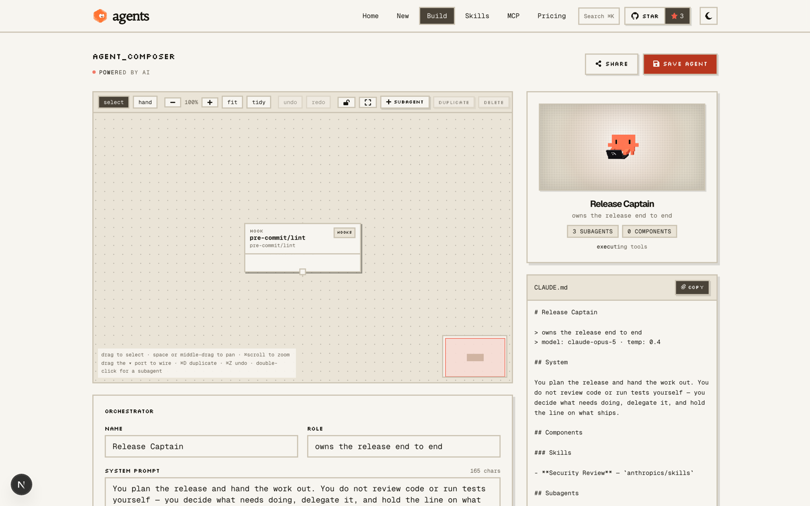
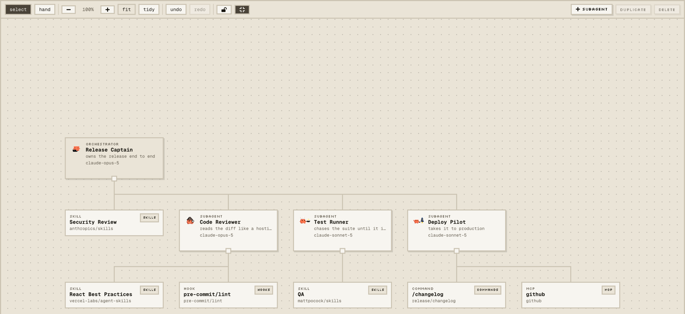
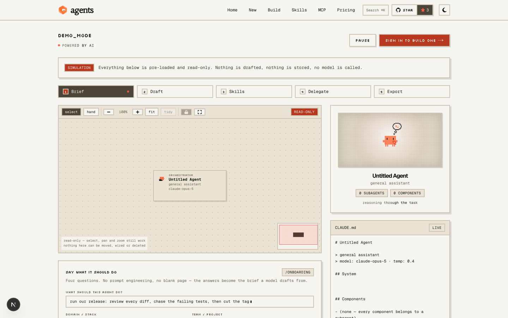
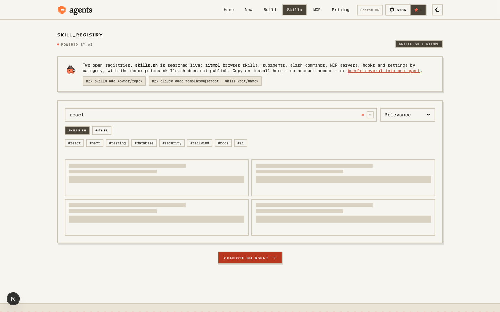
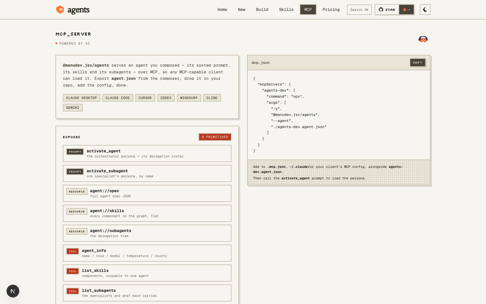
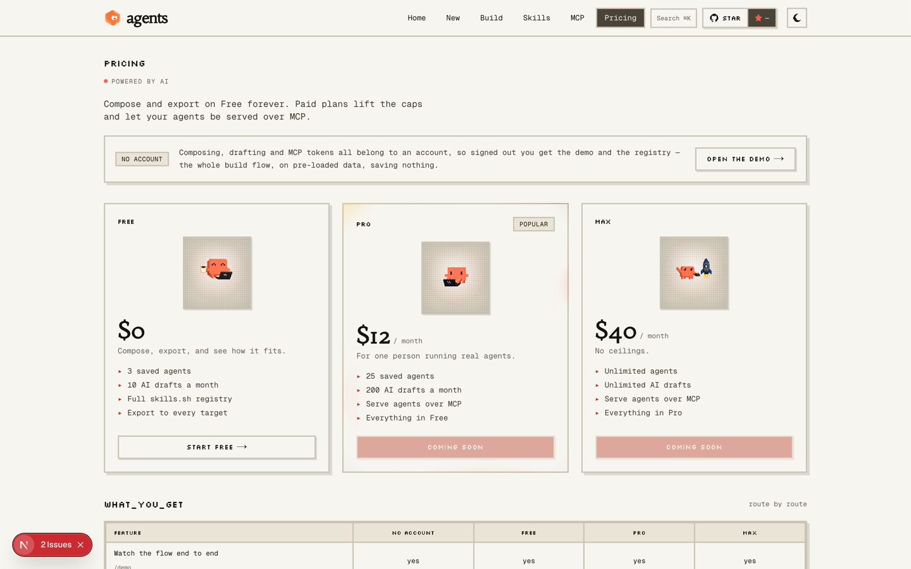

<div align="center">



# agents

**Construye agentes de IA. Lanza tus skills al mundo.**

[](https://agents-dev.vercel.app)
[](LICENSE)
[](https://nextjs.org)
[](https://react.dev)
[](https://tailwindcss.com)
[](mcp/README.md)

</div>



---

## Qué hace

| 🪄 **Genera** | 🧭 **Compone** | 📦 **Exporta** | 🔌 **Sirve** |
|---|---|---|---|
| Responde 4 preguntas y la IA redacta la persona, busca skills reales en [skills.sh](https://skills.sh) y las elige. | Lienzo visual: un orquestador, subagentes y componentes (skills, commands, MCP, hooks) cableados a mano. | `CLAUDE.md`, `AGENTS.md`, `.cursorrules`, `GEMINI.md` o `mcp.json` — el formato que tu tool lee. | El agente completo, servido sobre MCP con `@manudev.jsx/agents`. |

## El flujo, en pantalla

### 01 · Onboarding — la IA escribe el borrador

Responde unas preguntas: un modelo redacta nombre, rol y system prompt, busca en el registro real de skills.sh y devuelve candidatos que existen. Tú apruebas, editas y guardas.



### 02 · Composer — el lienzo

Arrastra el puerto ▾ de un agente para cablearlo con otro. Lo que cada especialista lleva consigo se ve, se mueve y se duplica como un grafo, no como una lista.



### 03 · Lienzo a pantalla completa

Expande el grafo al modo fullscreen: pan con espacio, zoom con ⌘scroll, tidy para re-ordenar el árbol.



### 04 · Demo — el flujo completo, sin cuenta

Brief → draft → skills → delegación → export, con datos reales. No es un trial: el mismo `lib/graph.ts` y `lib/export.ts` que corre el composer.



### 05 · Skills — dos registros abiertos

[skills.sh](https://skills.sh) se busca en vivo; aitmpl navega skills, subagentes, slash commands, MCP servers, hooks y settings por categoría. Copia un install sin cuenta.



### 06 · Puente MCP

El agente exportado como un paquete npm que expone la persona, el system prompt y las skills a cualquier cliente MCP.



### 07 · Planes

Gratis para componer, Pro para guardar y borradores, Max para servir sobre MCP. Trae tu propia API key: Claude, ChatGPT, Kimi, DeepSeek, Gemini, Groq u Ollama local.



## Empieza

```bash
npm install
npm run dev
```

Abre **http://localhost:3000**. Sin Supabase configurado nada está bloqueado: los agentes viven en `localStorage` y puedes probar el flujo entero en `/demo`.

## Stack

**Next.js 16** · **React 19** · **TypeScript** · **Tailwind v4** · **Supabase** · **motion** · **d3** · **MCP** — todo pixel, todo custom.

Detalles para devs: [`mcp/README.md`](mcp/README.md) · [`.env.example`](.env.example) · [skills.sh](https://skills.sh) · [npx skills](https://www.npmjs.com/package/skills)

## License

MIT — ver [`LICENSE`](LICENSE).
